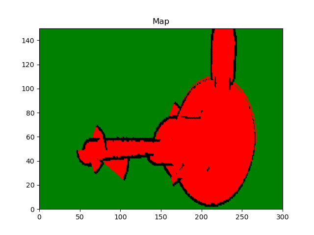
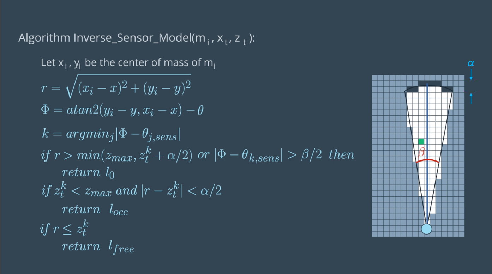
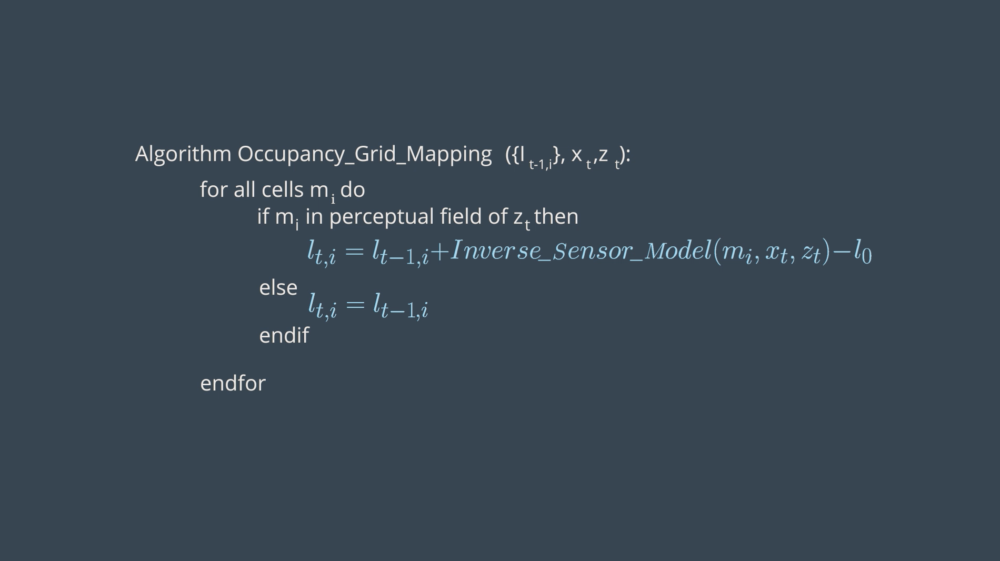

[](https://www.udacity.com/robotics)

# RoboND-OccupancyGridMappingLab
You will visualize the mapped environment through the generated image

#### Final outcome


### Operating system

- Linux Ubuntu 20.04 LTS (Focal)

### Dependencies

- g++
- cmake-v3.19
- python3.8-dev
- python3-numpy
- python3-matplotlib

### Compiling the Program
```sh
$ cd <repo root>
$ mkdir build && cd build
$ cmake ..
$ make
```

### Running the Program

```sh
$ cd <repo root>/bin
$ ./main
```

Output image will be generated in `<repo root>/Images/Map.png`.

### Implementation Details

1. Inverse Sensor Model

    

    Here α is the thickness of obstacles, and β the angle of a sensor beam.

    <br>

    ```cpp
    double inverseSensorModel(double x, double y, double theta, double xi, double yi, double sensorData[])
    {
        // Defining Sensor Characteristics
        double Zk, thetaK, sensorTheta;
        double minDelta = -1;
        double alpha = 200, beta = 20;

        //******************Compute r and phi**********************//
        double r = sqrt(pow(xi - x, 2) + pow(yi - y, 2));
        double phi = atan2(yi - y, xi - x) - theta;

        //Scaling Measurement to [-90 -37.5 -22.5 -7.5 7.5 22.5 37.5 90]
        for (int i = 0; i < 8; i++) {
            if (i == 0) {
                sensorTheta = -90 * (M_PI / 180);
            }
            else if (i == 1) {
                sensorTheta = -37.5 * (M_PI / 180);
            }
            else if (i == 6) {
                sensorTheta = 37.5 * (M_PI / 180);
            }
            else if (i == 7) {
                sensorTheta = 90 * (M_PI / 180);
            }
            else {
                sensorTheta = (-37.5 + (i - 1) * 15) * (M_PI / 180);
            }

            if (fabs(phi - sensorTheta) < minDelta || minDelta == -1) {
                Zk = sensorData[i];
                thetaK = sensorTheta;
                minDelta = fabs(phi - sensorTheta);
            }
        }

        //******************Evaluate the three cases**********************//
        if (r > min((double)Zmax, Zk + alpha / 2) || fabs(phi - thetaK) > beta / 2 || Zk > Zmax || Zk < Zmin) {
            return l0;
        }
        else if (Zk < Zmax && fabs(r - Zk) < alpha / 2) {
            return locc;
        }
        else if (r <= Zk) {
            return lfree;
        }
    }
    ```
    
2. Occupancy Grid Mapping algorithm

    

    ```cpp
    void occupancyGridMapping(double Robotx, double Roboty, double Robottheta, double sensorData[]){
        //******************Code the Occupancy Grid Mapping Algorithm**********************//
        for (int x = 0; x < mapWidth / gridWidth; x++) {
            for (int y = 0; y < mapHeight / gridHeight; y++) {
                double xi = x * gridWidth + gridWidth / 2 - robotXOffset;
                double yi = -(y * gridHeight + gridHeight / 2) + robotYOffset;
                if (sqrt(pow(xi - Robotx, 2) + pow(yi - Roboty, 2)) <= Zmax) {
                    l[x][y] = l[x][y] + inverseSensorModel(Robotx, Roboty, Robottheta, xi, yi, sensorData) - l0;
                }
            }
        }
    }
    ```

3. Map Visualization

    ```cpp
    void visualization()
    {
        //Graph Format
        plt::title("Map");
        plt::xlim(0, (int)(mapWidth / gridWidth));
        plt::ylim(0, (int)(mapHeight / gridHeight));

        // Draw every grid of the map:
        for (double x = 0; x < mapWidth / gridWidth; x++) {
            cout << "Remaining Rows= " << mapWidth / gridWidth - x << endl;
            for (double y = 0; y < mapHeight / gridHeight; y++) {
                if (l[x][y] == 0) { //Green unkown state
                    plt::plot({ x }, { y }, "g.");
                }
                else if (l[x][y] > 0) { //Black occupied state
                    plt::plot({ x }, { y }, "k.");
                }
                else { //Red free state
                    plt::plot({ x }, { y }, "r.");
                }
            }
        }

        //Save the image and close the plot
        plt::save("../Images/Map.png");
        plt::clf();
    }
    ```
